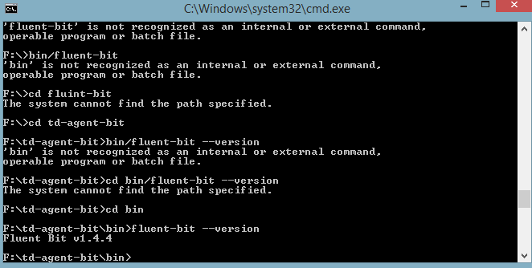
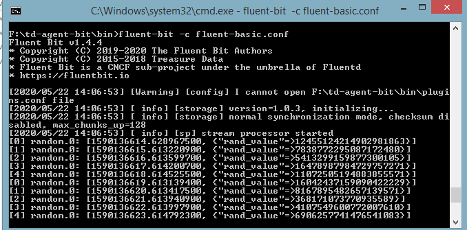
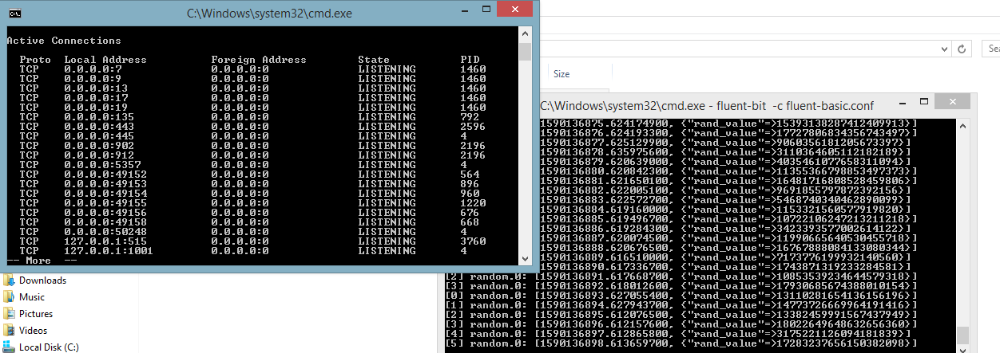

# fluent-bit-config
A small implementation of fluent-bit on my system

I used Windows package, since I was receiving error on Ubuntu 18.04 LTS reported [here](https://github.com/fluent/fluent-bit/issues/2194)

1. Check the version.

2. Built the configuration File as [fluent-basic](/fluent-basic.conf)
I have used the required easy format to not to overload this file by opening different [input.conf](/input.conf) and 
[output.conf](/output.conf)

3. Generated the random stream at the output 

4. Streams are visible and port listening of 445 is also visible at 

